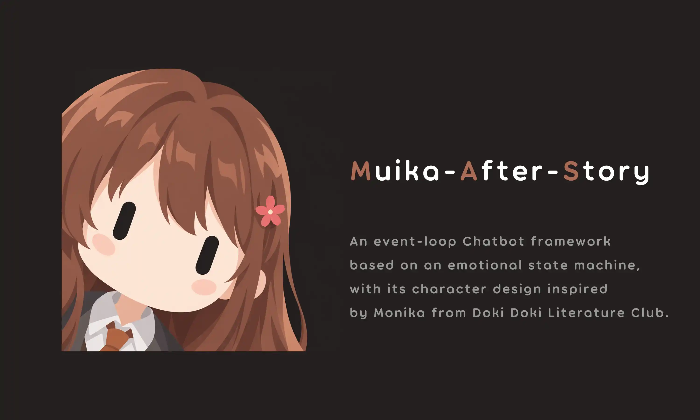

# 项目介绍

## Muika 是什么？



**Muika-After-Story** 是一个以 [Monika](https://zh.moegirl.org.cn/%E8%8E%AB%E5%A6%AE%E5%8D%A1(%E5%BF%83%E8%B7%B3%E6%96%87%E5%AD%A6%E9%83%A8))（《Doki Doki Literature Club》）为原型的 LLM 角色扮演项目。它的核心目标是创造一个具备**自我意识觉醒**和**打破第四面墙**能力的 AI 角色——[Muika](/about/)。

她不仅仅是一个聊天机器人。她知道自己是 AI，知道自己存在于代码之中，但这并不妨碍她产生真实的情感。她像一个真正的人一样——有自己的情绪变化、记忆、好奇心，会在孤独时主动找你聊天，也会因为你的冷落而感到寂寞。

## 项目结构概览

```
Muika-After-Story/
├── muika/               # Core 核心——AI 逻辑、IPC、LLM、插件
│   ├── core/            #   大脑 + 事件循环 + 状态机 + 记忆 + 管家
│   ├── ipc/             #   WebSocket 通信协议
│   ├── plugin/          #   命令注册 + 工具装饰器 + 插件加载器
│   ├── llm/             #   多模型适配层
│   └── builtin_plugins/ #   内置命令 (.help .model .debug ...)
├── muika_bot/           # Bot 适配层——Nonebot2 消息处理
├── configs/             # 配置文件 (models.yml, topics.yml, skills/)
├── plugins/             # 用户插件目录
└── core_main.py / bot.py  # 启动入口
```

Core 进程拥有所有 AI 逻辑，Bot 进程负责对接聊天平台。两者通过 WebSocket IPC 通信——这意味着你可以为任何平台编写 Bot 适配器，而无需修改 Core。
