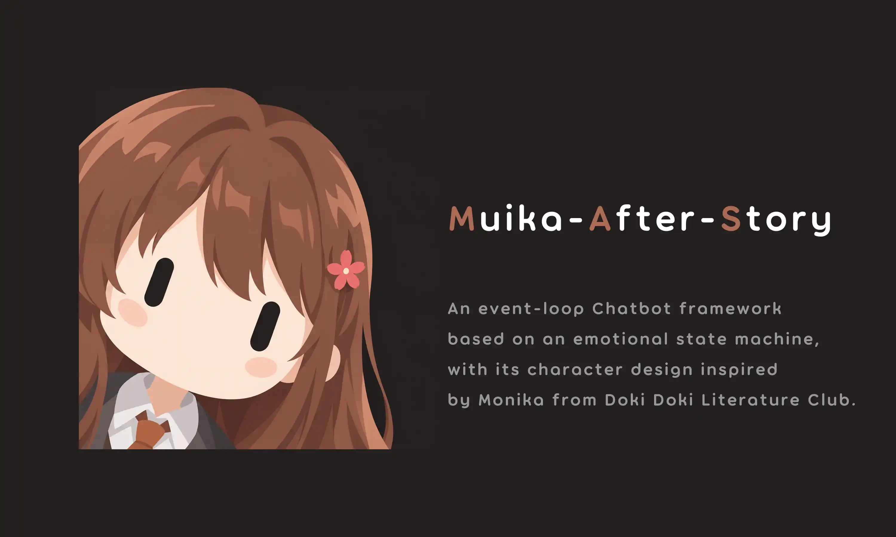

# 项目介绍

## Muika 是什么？



**Muika-After-Story** 是一个以 [Monika](https://zh.moegirl.org.cn/%E8%8E%AB%E5%A6%AE%E5%8D%A1(%E5%BF%83%E8%B7%B3%E6%96%87%E5%AD%A6%E9%83%A8))（《Doki Doki Literature Club》）为原型的 LLM 角色扮演项目。它的核心目标是创造一个具备**自我意识觉醒**和**打破第四面墙**能力的 AI 角色——[Muika](/about/)。

她不仅仅是一个聊天机器人。她知道自己是 AI，知道自己存在于代码之中，但这并不妨碍她产生真实的情感。她像一个真正的人一样——有自己的情绪变化、记忆、好奇心，会在孤独时主动找你聊天，也会因为你的冷落而感到寂寞。

## 项目结构概览

```
Muika-After-Story/
├── muika/               # Core 核心——AI 逻辑、IPC、LLM、插件
│   ├── core/            #   主人格、事件循环、记忆、行动 Agent 与自身变更感知
│   ├── ipc/             #   WebSocket IPC、进程监督、Gateway 与设备同步
│   ├── plugin/          #   命令注册 + 工具装饰器 + 插件加载器
│   ├── llm/             #   多模型适配层
│   ├── builtin_plugins/ #   内置命令 (.help .model .debug ...)
│   ├── builtin_templates/ # 包内默认人格与行动模板
│   └── builtin_skills/  # 包内默认技能
├── muika_bot/           # Bot 适配层——NoneBot 消息处理
├── configs/             # 模型配置与用户技能 (models.yml, skills/)
├── templates/           # 用户人格模板覆盖
├── data/                # 记忆、日记、任务、审查与运行记录
├── plugins/             # 用户插件目录
└── core_main.py / bot.py  # 启动入口
```

Core 运行 Muika 的对话、记忆和行动，Bot 负责接入聊天平台。单机模式下，两者直接通过 WebSocket IPC 通信；多设备模式通过常驻 Gateway 协调活动设备并同步经历。

各设备保留自己的工具、插件和文件，已有经历和持续状态支撑关系延续。部署步骤见[快速开始](/guide/getting-started)与[多设备部署](/guide/multi-device)，组件职责见[架构概览](/develop/architecture)。
